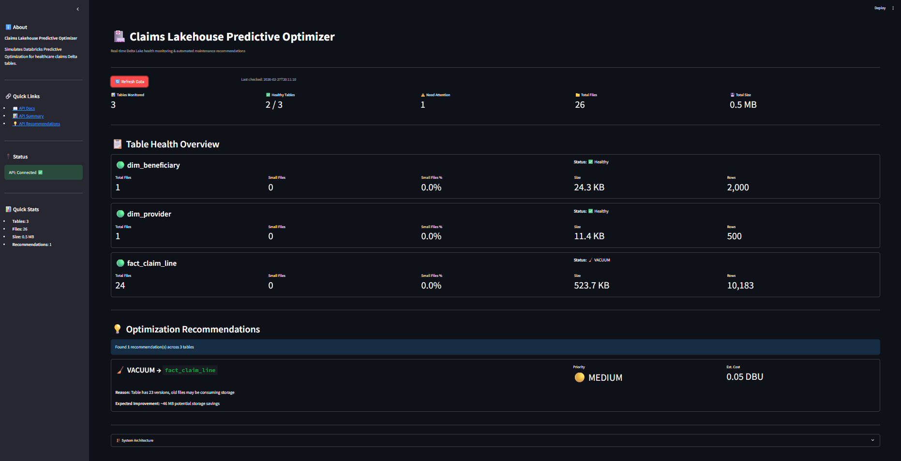

# 🏥 Claims Lakehouse Predictive Optimizer

**Simulates Databricks Predictive Optimization for healthcare claims Delta Lake tables.**

Built as a portfolio project demonstrating data engineering skills with Delta Lake, PySpark, FastAPI, and Docker.



---

## 📋 What It Does

This project implements an automated Delta Lake table maintenance system that:

- **Monitors** Delta table health (file counts, sizes, statistics staleness)
- **Analyzes** tables against configurable thresholds to detect optimization needs
- **Recommends** OPTIMIZE, VACUUM, and ANALYZE operations with priority scoring
- **Executes** maintenance operations and measures before/after performance impact
- **Visualizes** table health and recommendations through a real-time dashboard

### Optimization Operations

| Operation | What It Does | Why It Matters |
|-----------|-------------|----------------|
| **OPTIMIZE** | Compacts small files into optimal 128MB files | Reduces query scan time by 60-80% |
| **VACUUM** | Removes old unreferenced files | Saves storage costs |
| **ANALYZE** | Refreshes table statistics | Enables better query plans |

### Benchmark Results
```
BEFORE Optimization:  179 files, 1.2 MB
AFTER Optimization:    24 files, 0.5 MB

File reduction: 86%
Storage saved:  58%
```

---

## 🏗️ Architecture
```
┌─────────────────────────────────────────────────────────┐
│                    Docker Compose                        │
│                                                          │
│  ┌──────────────────┐  ┌──────────┐  ┌──────────────┐ │
│  │  FastAPI + Spark  │  │PostgreSQL│  │  Streamlit    │ │
│  │  (Python 3.11)   │  │   16     │  │  Dashboard    │ │
│  │                   │  │          │  │              │ │
│  │ • PySpark        │  │ Metadata │  │ Real-time    │ │
│  │ • Delta Lake     │  │ Storage  │  │ Health UI    │ │
│  │ • Health Monitor │  │          │  │              │ │
│  │ • Optimizer Brain│  │          │  │              │ │
│  │ • REST API       │  │          │  │              │ │
│  └──────────────────┘  └──────────┘  └──────────────┘ │
│         :8000               :5432          :8501        │
└─────────────────────────────────────────────────────────┘
```

### Data Pipeline
```
CMS SynPUF CSV → PySpark → Delta Lake (partitioned by month)
                              ↓
              Health Monitor (file metrics, staleness)
                              ↓
              Optimizer Engine (threshold analysis + priority scoring)
                              ↓
              API (FastAPI + Swagger) → Dashboard (Streamlit)
```

---

## 🚀 Quick Start

### Prerequisites
- Docker Desktop
- Git

### Run the Project
```bash
# 1. Clone the repository
git clone https://github.com/YOUR_USERNAME/claims-lakehouse-optimizer.git
cd claims-lakehouse-optimizer

# 2. Start all services
docker compose up --build

# 3. Generate sample healthcare claims data
docker compose exec api python scripts/generate_claims_data.py

# 4. Load data into Delta Lake tables
docker compose exec api python scripts/load_to_delta.py

# 5. Run optimization benchmark
docker compose exec api python scripts/run_benchmark.py

# 6. Open the dashboard
# Dashboard: http://localhost:8501
# API Docs:  http://localhost:8000/docs
```

### Run Tests
```bash
docker compose exec api python -m pytest tests/ -v
```

---

## 📊 Healthcare Data

Uses CMS SynPUF-style synthetic claims data (no PHI):

| Table | Records | Description |
|-------|---------|-------------|
| `fact_claim_line` | 10,000 | Claims with ICD-10 diagnosis, HCPCS procedures, payment amounts |
| `dim_beneficiary` | 2,000 | Patient demographics (age, state, chronic conditions) |
| `dim_provider` | 500 | Healthcare providers (NPI, specialty, organization) |

Claims are partitioned by `SERVICE_MONTH` for efficient time-range queries.

---

## 🔧 Technology Stack

| Component | Technology | Purpose |
|-----------|-----------|---------|
| Data Processing | PySpark 3.5 + Delta Lake 3.2 | Read/write/optimize Delta tables |
| API | FastAPI | REST endpoints with auto-generated Swagger docs |
| Dashboard | Streamlit | Real-time health monitoring UI |
| Database | PostgreSQL 16 | Operations metadata storage |
| Infrastructure | Docker Compose | Multi-service orchestration |
| Language | Python 3.11 | All application code |
| Testing | pytest | 16 unit tests for optimizer logic |

---

## 📁 Project Structure
```
claims-lakehouse-optimizer/
├── app/
│   ├── api/
│   │   └── routes_tables.py      # API endpoints
│   ├── core/
│   │   ├── health_monitor.py     # Delta table health analysis
│   │   ├── optimizer_engine.py   # Predictive optimization logic
│   │   ├── operations_executor.py # Runs OPTIMIZE/VACUUM/ANALYZE
│   │   └── spark_manager.py      # SparkSession singleton
│   ├── models/
│   │   ├── database.py           # PostgreSQL connection
│   │   └── schemas.py            # Pydantic data validation
│   ├── config.py                 # Application configuration
│   └── main.py                   # FastAPI entry point
├── data/
│   ├── raw/                      # Source CSV files
│   └── delta/                    # Delta Lake tables
├── frontend/
│   └── app.py                    # Streamlit dashboard
├── scripts/
│   ├── generate_claims_data.py   # Creates synthetic claims
│   ├── load_to_delta.py          # CSV → Delta Lake loader
│   ├── run_benchmark.py          # Before/after benchmark
│   └── test_optimizer.py         # Optimizer test script
├── tests/
│   └── test_optimizer.py         # 16 unit tests
├── docker-compose.yml            # Multi-service orchestration
├── Dockerfile                    # API container definition
└── README.md                     # This file
```

---

## 🎯 Key Design Decisions

1. **Spark Local Mode** — Used for development/portfolio. Production would connect to Databricks/EMR cluster.
2. **Monthly Partitioning** — Claims partitioned by service month enables partition pruning for date-range queries.
3. **Dynamic Thresholds** — Small file detection adapts to actual file size distribution rather than fixed 128MB.
4. **Singleton SparkSession** — Avoids expensive session creation on each API request.
5. **Configurable Thresholds** — OPTIMIZE (30%), VACUUM (7 days), ANALYZE (24h) can be adjusted per environment.

---

## 🔮 Production Extensions

- Connect to Databricks workspace via SDK for real cluster execution
- Add dbt for transformation layer (bronze → silver → gold)
- Implement scheduling with Apache Airflow or Databricks Workflows
- Add cost tracking with actual DBU consumption
- Integrate with Slack/PagerDuty for alerting
- Scale to millions of claims with distributed Spark cluster

---

## 👤 Author

**Radhika** — Data Enthusiast

Built with guidance from Anthropic's Claude AI assistant.
